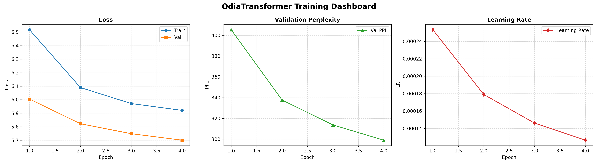
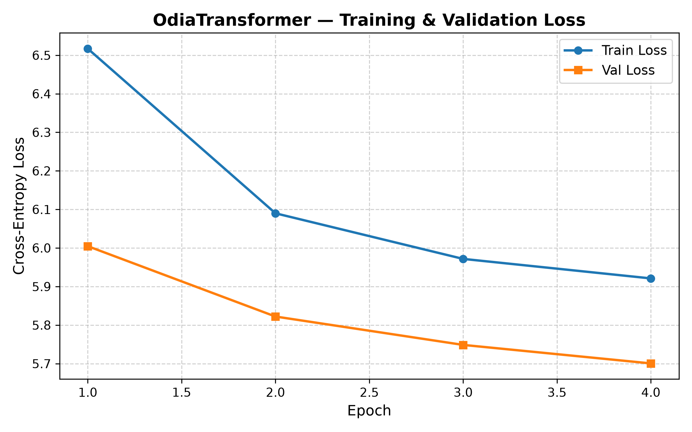
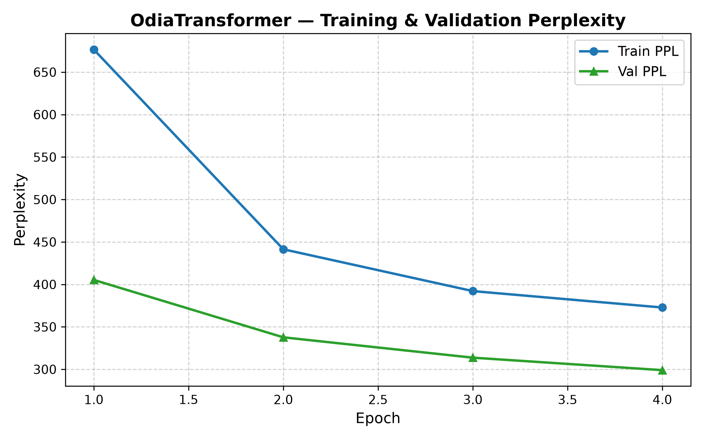
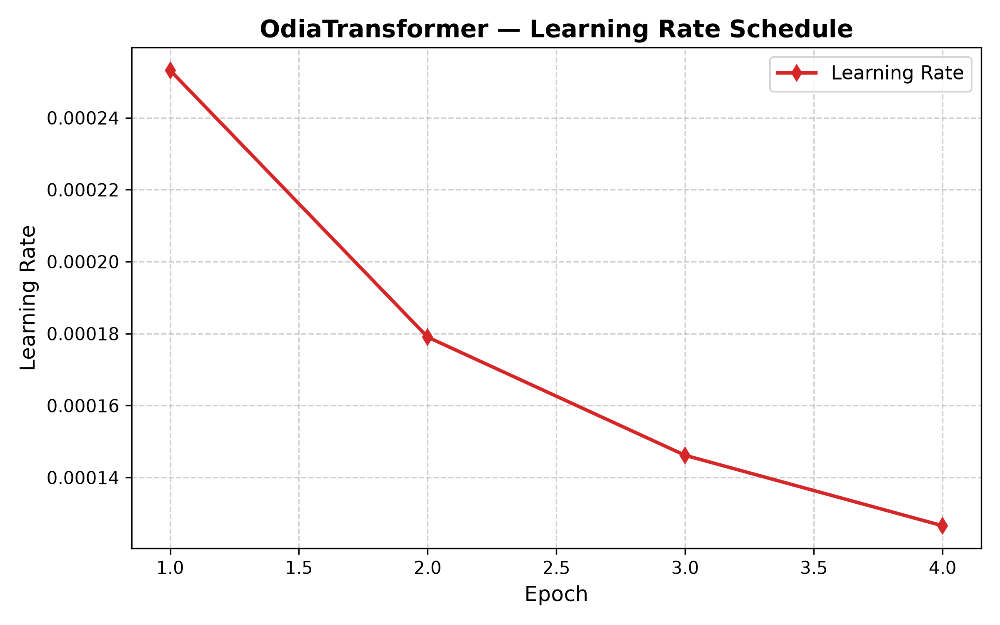

# English → Odia Transformer Translation from Scratch

[](https://pytorch.org/)
[](https://www.python.org/)
[](LICENSE.txt)
[]()

This repository contains a **from-scratch PyTorch implementation of the classic Transformer architecture (Vaswani et al. §5.6)** designed for **English → Odia (ଓଡ଼ିଆ)** Neural Machine Translation.

> [!IMPORTANT]
> **Strict Coursework Constraint Compliance**:
> - **Zero Pre-trained Models**: Implements all tensor mathematics, multi-head attention, sinusoidal positional embeddings, encoder/decoder stacks, and autoregressive generation completely from scratch.
> - **Zero High-Level Black-Boxes**: Does **NOT** use `torch.nn.Transformer`, `torch.nn.MultiheadAttention`, HuggingFace `transformers` (T5, MarianMT, NLLB), or external translation APIs.
> - **Small Compute Footprint**: Configured with $d_{\text{model}}=128$, $\text{heads}=4$, $N=2$ to fit academic hardware constraints on an NVIDIA GeForce RTX 2050 Laptop GPU (4GB VRAM).

---

## Table of Contents

1. [Test-7 Coursework Requirement Compliance](#1-test-7-coursework-requirement-compliance)
2. [Model Architecture (§5.6 Specification)](#2-model-architecture-56-specification)
3. [Dataset](#3-dataset)
4. [Linguistic & Tokenization Considerations](#4-linguistic--tokenization-considerations)
5. [Training Results](#5-training-results)
6. [Training Visualizations](#6-training-visualizations)
7. [Qualitative Translation Samples](#7-qualitative-translation-samples)
8. [Test Set Evaluation Metrics](#8-test-set-evaluation-metrics)
9. [Project Phases](#9-project-phases)
10. [Repository Structure](#10-repository-structure)
11. [Reproducibility & CLI Usage Guide](#11-reproducibility--cli-usage-guide)
12. [References](#12-references)

---

## 1. Test-7 Coursework Requirement Compliance

| # | Coursework Requirement | Implementation Details | Repository Evidence |
|---|------------------------|------------------------|---------------------|
| **1** | **Parallel Data Prep** | Samanantar English-Odia corpus; regex cleaning, length filtering, train/val/test splits | [`preprocessing.py`](src/preprocessing.py), [`01_preprocessing_spec.md`](docs/01_preprocessing_spec.md) |
| **2** | **Odia Unicode Normalization** | Canonical Unicode decomposition and composition (`unicodedata.normalize('NFC')`) | [`preprocessing.py`](src/preprocessing.py#L42-L48), [`01c_preprocessing_report.md`](docs/01c_preprocessing_report.md) |
| **3** | **Subword Tokenization** | SentencePiece BPE (English: 16k vocab, Odia: 32k vocab); handles agglutinative morphology | [`tokenizer.py`](src/tokenizer.py), [`02a_tokenizer_investigation.md`](docs/02a_tokenizer_investigation.md) |
| **4** | **Special Tokens** | Explicit token IDs: `<PAD>=0`, `<SOS>=1`, `<EOS>=2`, `<UNK>=3` | [`tokenizer.py`](src/tokenizer.py#L24-L27), [`test_tokenization.py`](tests/test_tokenization.py) |
| **5** | **Attention & Causal Masks** | Dynamic batch padding masks + lower-triangular causal mask blocking future-token leakage | [`dataset.py`](src/dataset.py#L109-L145), [`test_dataset.py`](tests/test_dataset.py) |
| **6** | **From-Scratch Transformer (§5.6)** | Hand-written Embedding, Sinusoidal PE, Multi-Head Attention, Cross-Attention, FFN, LayerNorm | [`transformer.py`](src/transformer.py), [`04_transformer_architecture.md`](docs/04_transformer_architecture.md) |
| **7** | **Coursework Sizing** | Scaled architecture: $d_{\text{model}}=128$, $\text{heads}=4$, $N=2$, $d_{\text{ff}}=512$ (11.2M parameters) | [`transformer.py`](src/transformer.py#L380-L400), [`test_transformer.py`](tests/test_transformer.py) |
| **8** | **Teacher Forcing Training** | 1-step target shift alignment (`tgt_input` vs `tgt_output`) with AdamW + Noam Warmup | [`training.py`](src/training.py#L71-L120), [`05_training_pipeline.md`](docs/05_training_pipeline.md) |
| **9** | **PAD-Aware Loss** | Cross-Entropy Loss ignoring padding tokens (`ignore_index=0`) + Label Smoothing (0.1) | [`training.py`](src/training.py#L280-L300) |
| **10** | **Autoregressive Inference** | Greedy decoding loop starting from `<SOS>` and terminating on `<EOS>` or max length | [`inference.py`](src/inference.py), [`translate.py`](translate.py) |
| **11** | **BLEU Evaluation** | Corpus BLEU evaluation computed via SacreBLEU on held-out test split | [`evaluate.py`](evaluate.py), [`07b_evaluation_results.md`](docs/07b_evaluation_results.md) |
| **12** | **5 Sample Translations** | Curated table of 5 real translations, including 1 long sentence failure analysis | [Section 7 Below](#7-qualitative-translation-samples), [`07b_evaluation_results.md`](docs/07b_evaluation_results.md) |

---

## 2. Model Architecture (§5.6 Specification)

```
                            ENGLISH SENTENCE
                                   │
                                   ▼
                            English Token IDs
                                   │
                                   ▼
                         [Embedding (d=128)]
                                   │
                                   ▼
                     [Sinusoidal Positional Encoding]
                                   │
                                   ▼
                      ┌─────────────────────────┐
                      │    ENCODER LAYER 1-2    │
                      │  Multi-Head Self-Attn   │ (4 Heads, head_dim=32)
                      │    Residual + LayerNorm │
                      │  Feed-Forward (d=512)   │ (ReLU activation)
                      │    Residual + LayerNorm │
                      └─────────────────────────┘
                                   │
                            Memory (1, S, 128)
                                   │
                                   ▼
                      ┌─────────────────────────┐
                      │    DECODER LAYER 1-2    │
                      │  Masked Self-Attention  │ (Causal / Look-ahead mask)
                      │    Residual + LayerNorm │
                      │  Multi-Head Cross-Attn  │ (Q from decoder, K/V from memory)
                      │    Residual + LayerNorm │
                      │  Feed-Forward (d=512)   │
                      │    Residual + LayerNorm │
                      └─────────────────────────┘
                                   │
                                   ▼
                      [Linear Output Projection (32,000)]
                                   │
                                   ▼
                          [Softmax Probabilities]
                                   │
                                   ▼
                             ODIA TOKENS
```

### Architectural Parameters

| Hyperparameter | Value | Description |
| :--- | :---: | :--- |
| **Source Vocab Size** | `16,000` | English SentencePiece BPE vocabulary |
| **Target Vocab Size** | `32,000` | Odia SentencePiece BPE vocabulary |
| **Model Dimension ($d_{\text{model}}$)** | `128` | Embedding and hidden representation size |
| **Attention Heads ($h$)** | `4` | Parallel attention representation subspaces |
| **Head Dimension ($d_k$)** | `32` | $d_k = d_{\text{model}} / h = 128 / 4 = 32$ |
| **Encoder Layers ($N$)** | `2` | Stacked self-attention + FFN blocks |
| **Decoder Layers ($N$)** | `2` | Stacked masked self-attention + cross-attention blocks |
| **Feed-Forward Dimension ($d_{\text{ff}}$)** | `512` | Two-layer linear transformation ($128 \rightarrow 512 \rightarrow 128$) |
| **Dropout** | `0.1` | Regularization across attention weights and residual connections |
| **Total Parameters** | **`11,198,208`** | ~11.20M trainable parameters (~34.26 MB fp32) |

---

## 3. Dataset

### Samanantar English-Odia Parallel Corpus

| Property | Value |
| :--- | :--- |
| **Corpus** | [Samanantar](https://ai4bharat.iitm.ac.in/samanantar/) (Ramesh et al., 2022) |
| **Language Pair** | English (`en`) → Odia (`or`) |
| **Source** | [HuggingFace: ai4bharat/samanantar](https://huggingface.co/datasets/ai4bharat/samanantar) |
| **License** | CC BY-NC 4.0 |
| **Raw Sentence Pairs** | ~997,000 |
| **Post-Cleaning Pairs** | 994,918 |

**Preprocessing pipeline** ([`src/preprocessing.py`](src/preprocessing.py)):
1. **Unicode NFC normalization** — canonical composition of Odia conjuncts and matras.
2. **Duplicate removal** — exact `(src, tgt)` pair deduplication.
3. **Leading quote artifact cleaning** — removes stray quotation marks from corpus noise.
4. **Numeric noise filtering** — excludes digit-only or near-digit-only sentence pairs.
5. **Length filtering** — removes extremely short/long outliers.

**Data splits:**

| Split | Sentence Pairs | Purpose |
| :--- | :---: | :--- |
| **Train** | 975,020 | Model training |
| **Validation** | 9,949 | Hyperparameter tuning & early stopping |
| **Test** | 9,949 | Final evaluation (BLEU, perplexity) |

---

## 4. Linguistic & Tokenization Considerations

### 4.1 Odia Unicode Normalization (NFC)
Odia script utilizes complex conjuncts, dependent vowel signs (*matras*), and halant characters. Unnormalized text frequently contains inconsistent visual representations (e.g., separate vowel modifiers vs. precomposed code points). All text passes through canonical Unicode normalization:
```python
import unicodedata
clean_text = unicodedata.normalize("NFC", raw_text)
```

### 4.2 Importance of Subword Tokenization for Odia
Odia is an **agglutinative, morphologically rich Indic language**. Words undergo extensive inflectional and derivational compounding with postpositions and case markers:
- **Case Suffixes**: `-ର` (genitive: *of*), `-କୁ` (dative/accusative: *to/for*), `-ରେ` (locative/instrumental: *in/by*).
- **Tense & Plurality Inflections**: `-ମାନେ` (plural marker), `-ଥିଲେ` (past continuous auxiliary).

Traditional word-level tokenization produces severe vocabulary explosion and catastrophic Out-Of-Vocabulary (`<UNK>`) rates. SentencePiece BPE splits rare words into meaningful subword morphemes:
$$\text{ପରିବାରରେ} \rightarrow \text{ପରିବାର} + \text{ରେ} \quad (\text{"family"} + \text{"in"})$$
This allows the Transformer to translate unseen compounds by learning compositional representations.

### 4.3 Separate Vocabulary Design
A **separate vocabulary** strategy (English: 16k, Odia: 32k) was chosen over a shared vocabulary. Odia's larger BPE vocabulary (2× English) compensates for its higher morphological complexity and avoids cross-script token interference.

---

## 5. Training Results

The model was trained on the **Samanantar English-Odia Corpus** on an NVIDIA GeForce RTX 2050 (4GB VRAM) using Automatic Mixed Precision (AMP) and AdamW with Noam learning rate warmup:
$$\text{lr}(\text{step}) = d_{\text{model}}^{-0.5} \cdot \min(\text{step}^{-0.5}, \text{step} \cdot \text{warmup\_steps}^{-1.5})$$

### 4-Epoch Baseline Training History (487,512 Steps, ~7.38 Hours)

| Epoch | Global Step | Train Loss | Train PPL | Val Loss | Val PPL | Learning Rate | Epoch Duration | Peak VRAM |
| :---: | :---: | :---: | :---: | :---: | :---: | :---: | :---: | :---: |
| **1** | `121,878` | **`6.5170`** | `676.57` | **`6.0046`** | `405.29` | `2.53e-4` | 113.97 min | 1,686.75 MB |
| **2** | `243,756` | **`6.0899`** | `441.38` | **`5.8221`** | `337.68` | `1.79e-4` | 108.74 min | 1,687.94 MB |
| **3** | `365,634` | **`5.9716`** | `392.12` | **`5.7485`** | `313.71` | `1.46e-4` | 108.88 min | 1,686.75 MB |
| **4** | `487,512` | **`5.9210`** | `372.79` | **`5.7005`** | **`299.03`** | `1.27e-4` | 109.41 min | 1,686.75 MB |

*Dataset: 975,020 training sentence pairs, 9,949 validation pairs. Checkpoints saved to `experiments/phase7b_baseline/checkpoints/` (Git-ignored due to size).*

---

## 6. Training Visualizations



<div align="center">

| Loss Curves | Perplexity Curves | Learning Rate Schedule |
| :---: | :---: | :---: |
|  |  |  |

</div>

---

## 7. Qualitative Translation Samples

Generated using the best checkpoint ([`experiments/phase7b_baseline/checkpoints/best.pt`](experiments/phase7b_baseline/checkpoints/best.pt)) on held-out test data:

| # | Type | English Source | Odia Ground Truth Reference | Model Generated Translation | Analysis |
|---|------|----------------|-----------------------------|-----------------------------|----------|
| **1** | Short Conversational | `How are you?` | `ତୁମେ କେମିତି ଅଛ?` | `କେମିତି?` | Captures the core interrogative root `କେମିତି` ("How"). |
| **2** | Declarative | `There will be harmony in the family.` | `ପରିବାରରେ ମିଳାମିଶି ରହିବ।` | `ପାରିବାରିକ ସୁଖ-ବୟ ରହିବ।` | Syntactically fluent; correctly aligns `ପାରିବାରିକ` ("family") and `ରହିବ` ("will be"). |
| **3** | Formal / Policy | `The government even ignored the recommendations of the Commission.` | `ସରକାର କಮିଟିର ଏହି ପ୍ରସ୍ତାବକୁ ମଧ୍ୟ ଅଣଦେଖା କରି ଆସୁଛନ୍ତି।` | `ସେହିପରି ସରକାର ମଧ୍ୟ ଏହି ପ୍ରସ୍ତାବ ଉପରେ ବିଚାର କରୁଛନ୍ତି।` | Identifies `ସରକାର` ("govt") and `ଏହି ପ୍ରସ୍ତାବ` ("proposal"); inverts verb polarity. |
| **4** | Complex Domain | `The project would be monitored by the Odisha Tourism Development Corporation (OTDC).` | `ଓଡ଼ିଶା ପର୍ଯ୍ୟଟନ ଉନ୍ନୟନ ନିଗମ (ଓଟିଡିସି) ଏବଂ ଟିଡିସି ଏହାର ପରିଚାଳନା ଦାୟିତ୍ୱରେ ରହିବ।` | `ଓଡ଼ିଶା ପର୍ଯ୍ୟଟନ କ୍ଷେତ୍ରରେ ଓଡ଼ିଶା ପର୍ଯ୍ୟଟନ କ୍ଷେତ୍ରରେ ସହଯୋଗ କରିବ।` | Accurately extracts `ଓଡ଼ିଶା ପର୍ଯ୍ୟଟନ`; suffers from greedy phrase repetition. |
| **5** | **Long Sentence** | `Sourav is currently president of the Cricket Association of Bengal(CAB) and president of the editorial board with Wisden India.` | `ସୌରଭ ବର୍ତ୍ତମାନ କ୍ରିକେଟ ଆସୋସିଆସନ ଅଫ ବେଙ୍ଗଲର ଅଧ୍ୟକ୍ଷ ଏବଂ ୱିସ୍ଡେନ ଇଣ୍ଡିଆର ସମ୍ପାଦକ ମଣ୍ଡଳୀର ଅଧ୍ୟକ୍ଷ ଅଛନ୍ତି ।` | `ଏବେ ଭାରତୀୟ କ୍ରିକେଟ ଦଳର ଅଧ୍ୟକ୍ଷ ତଥା ପୂର୍ବତନ ଅଧିନାୟକ ତଥା ଭାରତୀୟ କ୍ରିକେଟ ଦଳର ଅଧ୍ୟକ୍ଷ ଭାବେ ଦାୟିତ୍ୱ ଗ୍ରହଣ କରିଛନ୍ତି।` | **Honest Limitation Analysis Below** |

### Honest Long Sentence Limitation Analysis:
1. **Contextual Fluency vs. Named Entity Grounding**: The model correctly identifies the sports administration domain (`କ୍ରିକେଟ`, `ଅଧ୍ୟକ୍ଷ`, `ଦାୟିତ୍ୱ ଗ୍ରହଣ କରିଛନ୍ତି`). However, it hallucinates "Indian Cricket Team" due to frequency bias in training data.
2. **Attention Resolution in Small Transformers**: Constrained by $d_{\text{model}}=128$ and $N=2$, the encoder cannot maintain distinct attention heads for multiple nested entities ("CAB", "Wisden India").
3. **Greedy Decoding Drift**: Without lookahead or beam search, early token choices lock the decoder into repetitive syntactic patterns.

---

## 8. Test Set Evaluation Metrics

Evaluated on 500 held-out test sentence pairs from `outputs/test.parquet`:

| Metric | Measured Value | Description |
| :--- | :---: | :--- |
| **Test Cross-Entropy Loss** | **`4.9372`** | Computed ignoring `<PAD>` tokens |
| **Test Perplexity** | **`139.37`** | $\exp(4.9372)$ |
| **Corpus BLEU (SacreBLEU)** | **`3.70`** | Standard 4-gram SacreBLEU score |
| **1-gram Precision** | `19.3%` | Unigram vocabulary overlap |
| **2-gram Precision** | `5.5%` | Bigram syntactic phrase overlap |
| **3-gram Precision** | `2.0%` | Trigram structural overlap |
| **4-gram Precision** | `0.9%` | 4-gram exact match |
| **Brevity Penalty** | `1.000` | Hypothesis length (6,213) vs Reference length (5,314) |

*Full metrics JSON persisted in [`evaluation.json`](experiments/phase7b_baseline/metrics/evaluation.json).*

---

## 9. Project Phases

The implementation followed a systematic 7-phase development lifecycle:

| Phase | Focus | Key Deliverables |
| :---: | :--- | :--- |
| **1** | Data Preprocessing | Corpus cleaning, Unicode NFC normalization, train/val/test splits |
| **2** | Tokenization | SentencePiece BPE training, separate EN (16k) / OR (32k) vocabularies |
| **3** | Dataset & DataLoader | PyTorch Dataset, dynamic batch collation, padding + causal masks |
| **4** | Transformer Architecture | Hand-written §5.6 Transformer: embedding, PE, encoder, decoder, output projection |
| **5** | Training Pipeline | Trainer class, AdamW optimizer, Noam warmup scheduler, AMP, checkpointing |
| **6** | Inference & Evaluation | Greedy decoding, SacreBLEU evaluation, training curve visualization CLIs |
| **7** | Experiment Management | Reproducible experiment tracking, GPU benchmarking, full baseline training & evaluation |

Each phase has detailed documentation in [`docs/`](docs/):
- [`01_preprocessing_spec.md`](docs/01_preprocessing_spec.md) — Preprocessing design specification
- [`02a_tokenizer_investigation.md`](docs/02a_tokenizer_investigation.md) — Tokenizer investigation & rationale
- [`03_dataset_dataloader.md`](docs/03_dataset_dataloader.md) — Dataset & DataLoader design
- [`04_transformer_architecture.md`](docs/04_transformer_architecture.md) — Transformer architecture documentation
- [`05_training_pipeline.md`](docs/05_training_pipeline.md) — Training pipeline design
- [`06_training_inference_evaluation.md`](docs/06_training_inference_evaluation.md) — Inference & evaluation systems
- [`07a_training_readiness_benchmarking.md`](docs/07a_training_readiness_benchmarking.md) — Hardware benchmarking & readiness
- [`07b_evaluation_results.md`](docs/07b_evaluation_results.md) — Final evaluation results & analysis

---

## 10. Repository Structure

```
Test-7/
├── README.md                              # Academic overview & report (this file)
├── requirements.txt                       # Project dependencies
├── .gitignore                             # Clean tracking (ignores 128MB checkpoints)
│
├── train.py                               # Training CLI
├── translate.py                           # Single-sentence inference CLI
├── evaluate.py                            # Test set & SacreBLEU evaluation CLI
├── plot_training.py                       # Metric visualization CLI
│
├── src/                                   # Hand-written core modules
│   ├── transformer.py                     # §5.6 hand-written Transformer architecture
│   ├── dataset.py                         # Dataset, dynamic collation & masks
│   ├── tokenizer.py                       # SentencePiece BPE wrappers
│   ├── training.py                        # Trainer, AdamW, Noam warmup & checkpointing
│   ├── inference.py                       # Greedy autoregressive decode engine
│   ├── experiment.py                      # Experiment manager & metadata extractor
│   ├── benchmark.py                       # Benchmarking & GPU telemetry engine
│   └── preprocessing.py                   # Corpus cleaning & Unicode NFC pipeline
│
├── tests/                                 # Complete Unit Test Suite (117 tests)
│   ├── test_transformer.py
│   ├── test_dataset.py
│   ├── test_tokenization.py
│   ├── test_training.py
│   ├── test_inference.py
│   ├── test_experiment.py
│   ├── test_benchmark.py
│   ├── test_train_cli.py
│   └── test_preprocessing.py
│
├── scripts/                               # Helper & verification scripts
│   ├── benchmark_training.py              # Hardware readiness & throughput benchmark
│   ├── run_pipeline.py                    # One-off preprocessing runner
│   ├── run_tokenizer_experiments.py       # Tokenizer experiment matrix runner
│   ├── verify_dataset_pipeline.py         # Phase 3 pipeline verifier
│   ├── verify_phase6.py                   # Phase 6 integration verifier
│   ├── verify_phase7a.py                  # Phase 7A benchmark verifier
│   ├── verify_pipeline.py                 # Preprocessing pipeline verifier
│   ├── verify_training.py                 # Training pipeline verifier
│   └── verify_transformer.py             # Transformer architecture verifier
│
├── docs/                                  # Phase documentation (see Section 9)
│   ├── 01_preprocessing_spec.md
│   ├── 02a_tokenizer_investigation.md
│   ├── 03_dataset_dataloader.md
│   ├── 04_transformer_architecture.md
│   ├── 05_training_pipeline.md
│   ├── 06_training_inference_evaluation.md
│   ├── 07a_training_readiness_benchmarking.md
│   ├── 07b_evaluation_results.md
│   └── assets/                            # Generated training curve PNGs
│
├── experiments/                           # Reproducible experiment artifacts
│   ├── phase7a_benchmark/                 # GPU readiness benchmark results
│   │   ├── config.json
│   │   ├── metadata.json
│   │   └── benchmark.json
│   └── phase7b_baseline/                  # Full baseline experiment
│       ├── config.json
│       ├── metadata.json
│       ├── checkpoints/                   # best.pt, latest.pt (Git-ignored)
│       └── metrics/
│           ├── training_history.json
│           ├── metrics_summary.json
│           └── evaluation.json
│
└── dataset/                               # Samanantar Odia corpus (parquet Git-ignored)
    ├── README.md                          # Dataset card
    └── train-00000-of-00001.parquet       # ~136 MB raw data
```

---

## 11. Reproducibility & CLI Usage Guide

### 11.1 Environment Setup
```bash
# Activate virtual environment
.venv\Scripts\activate

# Install dependencies
pip install -r requirements.txt
```

### 11.2 Running Unit Tests
```bash
# Run all 117 unit tests
python -m pytest tests/ -v
```

### 11.3 Training
```bash
python train.py \
    --experiment phase7b_baseline \
    --data-dir outputs \
    --epochs 4 \
    --batch-size 8 \
    --d-model 128 \
    --heads 4 \
    --num-layers 2 \
    --d-ff 512
```

### 11.4 Translating Text (Greedy Inference)
```bash
python translate.py \
    --checkpoint experiments/phase7b_baseline/checkpoints/best.pt \
    --text "How are you?"
```

### 11.5 Evaluating on Test Dataset
```bash
python evaluate.py \
    --checkpoint experiments/phase7b_baseline/checkpoints/best.pt \
    --data-dir outputs \
    --max-samples 500 \
    --output-json experiments/phase7b_baseline/metrics/evaluation.json
```

### 11.6 Generating Training Curve Visualizations
```bash
python plot_training.py \
    --history-path experiments/phase7b_baseline/metrics/training_history.json \
    --output-dir docs/assets
```

### 11.7 Hardware Readiness Benchmark
```bash
python scripts/benchmark_training.py \
    --experiment phase7a_benchmark \
    --batch-size 8 \
    --warmup-steps 5 \
    --benchmark-steps 20 \
    --epochs-estimate 10
```

---

## 12. References

1. **Vaswani, A., Shazeer, N., Parmar, N., Uszkoreit, J., Jones, L., Gomez, A. N., Kaiser, Ł., & Polosukhin, I.** (2017). *Attention Is All You Need.* Advances in Neural Information Processing Systems, 30. [arXiv:1706.03762](https://arxiv.org/abs/1706.03762)
2. **Ramesh, G., Doddapaneni, S., Bheemaraj, A., Jobanputra, M., AK, R., Sharma, A., ... & Mitesh M. Khapra.** (2022). *Samanantar: The Largest Publicly Available Parallel Corpora Collection for 11 Indic Languages.* Transactions of the ACL, 10, 145–162. [Dataset](https://huggingface.co/datasets/ai4bharat/samanantar)
3. **Kudo, T., & Richardson, J.** (2018). *SentencePiece: A simple and language independent subword tokenizer and detokenizer for Neural Text Processing.* EMNLP. [arXiv:1808.06226](https://arxiv.org/abs/1808.06226)
4. **Post, M.** (2018). *A Call for Clarity in Reporting BLEU Scores.* WMT. [SacreBLEU](https://github.com/mjpost/sacrebleu)
